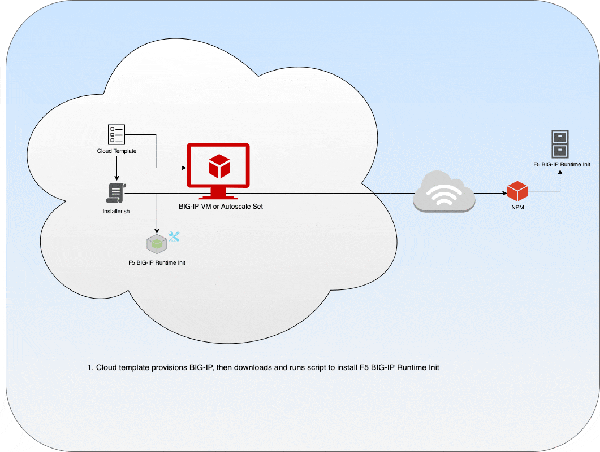

# f5-bigip-runtime-init
## NOTE: This project is under active development.

F5 BIG-IP runtime init installs and configures BIG-IP Toolchain components, while also providing runtime rendering of entities such as secrets, metadata values, etc. into the Toolchain declarations resulting in a complete overlay deployment tool for configuring a BIG-IP.

## Value

The F5 BIG-IP runtime init package will eliminate the need for inscrutable, inflexible, and error-prone custom scripting in our cloud templates. It will allow us to easily extend our popular solutions for use with other provisioning tools, such as Terraform and Ansible, as well as any new cloud environments we may choose support in the future. It will also provide a mechanism for rendering secrets and other runtime variables (such as hostname and license key) into Automation Toolchain declaration files, removing the need to encrypt and store sensitive information locally on BIG-IP.



## Requirements

This repository includes both the F5 BIG-IP runtime init source code and an installer script for onboarding the main package.

The installer script will do the following:

- Determine the cloud environment where the script is running
- Download the appropriate cloud-specific source archive (or the all-inclusive package if cloud is not detected)
- Install the source archive and create a command alias for f5-bigip-runtime-init

Based on the content of the provided cloud_config.yaml file, F5 BIG-IP runtime init will do the following:

- Download, verify, and install F5 Automation Toolchain components (DO, AS3, TS, CFE)
- Accept Automation Toolchain declarations in the form of URLs and/or local files
- Get secrets from cloud provider secret management APIs (Azure KeyVault, AWS Secret Manager, GCP Secrets Manager)
- Render valid Automation Toolchain declarations based on rendered runtime variables (such as secrets above) and provided declarations
- POST rendered declarations to Automation Toolchain endpoints and verify success or failure

## Pre-requisites

- Node.js v8.0.0 or later (to run locally)
- BIG-IP 15.0 or later
- A mechanism to copy the configuration file to the BIG-IP instance (cloud-init, custom data)
- Internet access for downloading installer script and runtime init package

## Usage

- Install F5 BIG-IP runtime init: ```curl https://cdn.f5.com/product/cloudsolutions/f5-bigip-runtime-init/v0.9.0/scripts/install.sh | bash```
- Use F5 BIG-IP runtime init: ```f5-bigip-runtime-init --config-file /config/cloud/cloud_config.yaml```
- Compare this with the current code for onboarding a BIG-IP HA pair in Azure:
```json
"commandToExecute": "[concat('function cp_logs() { cd /var/lib/waagent/custom-script/download && cp `ls -r | head -1`/std* /var/log/cloud/azure; cd /var/log/cloud/azure && cat stdout stderr > install.log; }; CLOUD_LIB_DIR=/config/cloud/azure/node_modules/@f5devcentral; mkdir -p $CLOUD_LIB_DIR && cp f5-cloud-libs*.tar.gz* /config/cloud; mkdir -p /var/config/rest/downloads && cp ', variables('f5AS3Build'), ' /var/config/rest/downloads; mkdir -p /var/log/cloud/azure; /usr/bin/install -m 400 /dev/null /config/cloud/.passwd; /usr/bin/install -m 400 /dev/null /config/cloud/.azCredentials; /usr/bin/install -b -m 755 /dev/null /config/verifyHash; /usr/bin/install -b -m 755 /dev/null /config/installCloudLibs.sh; /usr/bin/install -b -m 755 /dev/null /config/cloud/managedRoutes; IFS=', variables('singleQuote'), '%', variables('singleQuote'), '; echo -e ', variables('verifyHash'), ' > /config/verifyHash; echo -e ', variables('installCloudLibs'), ' > /config/installCloudLibs.sh; echo -e ', variables('appScript'), ' | /usr/bin/base64 -d > /config/cloud/deploy_app.sh; chmod +x /config/cloud/deploy_app.sh; echo -e ', variables('installCustomConfig'), ' >> /config/customConfig.sh; echo -e ', parameters('managedRoutes'), ' > /config/cloud/managedRoutes; unset IFS; bash /config/installCloudLibs.sh; source $CLOUD_LIB_DIR/f5-cloud-libs/scripts/util.sh; encrypt_secret ', variables('singleQuote'), '{\"clientId\": \"', parameters('clientId'), '\", \"tenantId\": \"', parameters('tenantId'), '\", \"secret\": \"', parameters('servicePrincipalSecret'), '\", \"subscriptionId\": \"', variables('subscriptionID'), '\", \"storageAccount\": \"', variables('newDataStorageAccountName'), '\", \"storageKey\": \"', listKeys(resourceId('Microsoft.Storage/storageAccounts', variables('newDataStorageAccountName')), variables('storageApiVersion')).keys[0].value, '\", \"resourceGroupName\": \"', variables('resourceGroupName'), '\", \"uniqueLabel\": \"', variables('dnsLabel'), '\", \"location\": \"', variables('location'), '\"}', variables('singleQuote'), ' \"/config/cloud/.azCredentials\" \"\" true; encrypt_secret ', variables('singleQuote'), variables('adminPasswordOrKey'), variables('singleQuote'), ' \"/config/cloud/.passwd\" true; $CLOUD_LIB_DIR/f5-cloud-libs/scripts/createUser.sh --user svc_user --password-file /config/cloud/.passwd --password-encrypted; ', variables('allowUsageAnalytics')[parameters('allowUsageAnalytics')].hashCmd, '; /usr/bin/f5-rest-node $CLOUD_LIB_DIR/f5-cloud-libs/scripts/onboard.js --no-reboot --output /var/log/cloud/azure/onboard.log --signal ONBOARD_DONE --log-level info --cloud azure --install-ilx-package file:///var/config/rest/downloads/', variables('f5AS3Build'), ' --host ', variables('mgmtSubnetPrivateAddress'), ' --port ', variables('bigIpMgmtPort'), ' --ssl-port ', variables('bigIpMgmtPort'), ' -u svc_user --password-url file:///config/cloud/.passwd --password-encrypted --hostname ', concat(variables('instanceName'), '0.', variables('location'), '.cloudapp.azure.com'), ' --license ', parameters('licenseKey1'), ' --ntp ', parameters('ntpServer'), ' --tz ', parameters('timeZone'), ' --modules ', parameters('bigIpModules'), ' --db tmm.maxremoteloglength:2048', variables('allowUsageAnalytics')[parameters('allowUsageAnalytics')].metricsCmd, '; /usr/bin/f5-rest-node $CLOUD_LIB_DIR/f5-cloud-libs/scripts/network.js --output /var/log/cloud/azure/network.log --wait-for ONBOARD_DONE --host ', variables('mgmtSubnetPrivateAddress'), ' --port ', variables('bigIpMgmtPort'), ' -u svc_user --password-url file:///config/cloud/.passwd --password-encrypted --default-gw ', variables('tmmRouteGw'), ' --vlan name:external,nic:1.1 --vlan name:internal,nic:1.2 ', variables('netCmd'), ' --self-ip name:self_2nic,address:', variables('extSubnetPrivateAddress'), ',vlan:external --self-ip name:self_3nic,address:', variables('intSubnetPrivateAddress'), ',vlan:internal --log-level info; echo \"/usr/bin/f5-rest-node $CLOUD_LIB_DIR/f5-cloud-libs-azure/scripts/failoverProvider.js\" >> /config/failover/tgactive; echo \"/usr/bin/f5-rest-node $CLOUD_LIB_DIR/f5-cloud-libs-azure/scripts/failoverProvider.js\" >> /config/failover/tgrefresh; tmsh modify cm device ', concat(variables('instanceName'), '0.', variables('location'), '.cloudapp.azure.com'), ' unicast-address { { ip ', variables('intSubnetPrivateAddress'), ' port 1026 } } mirror-ip ', variables('intSubnetPrivateAddress'), '; ', variables('failoverCmdArray')[parameters('bigIpVersion')], '; /usr/bin/f5-rest-node $CLOUD_LIB_DIR/f5-cloud-libs/scripts/cluster.js --output /var/log/cloud/azure/cluster.log --log-level info --host ', variables('mgmtSubnetPrivateAddress'), ' --port ', variables('bigIpMgmtPort'), ' -u svc_user --password-url file:///config/cloud/.passwd --password-encrypted --config-sync-ip ', variables('intSubnetPrivateAddress'), ' --create-group --device-group Sync --sync-type sync-failover --device ', concat(variables('instanceName'), '0.', variables('location'), '.cloudapp.azure.com'), ' --network-failover --auto-sync --save-on-auto-sync; bash /config/cloud/deploy_app.sh ', variables('commandArgs'), '; if [[ $? == 0 ]]; then tmsh load sys application template f5.service_discovery.tmpl; tmsh load sys application template f5.cloud_logger.v1.0.0.tmpl; base=', variables('extSubnetPrivateAddressPrefix'), variables('extSubnetPrivateAddressSuffixInt'), '; f3=$(echo $base | cut -d. -f1-3); last=$(echo $base | cut -d. -f4); for i in $(seq 1 ', variables('numberOfExternalIps'), '); do addr=${f3}.${last}; last=$((last+1)); tmsh create ltm virtual-address $addr address $addr; done; ', variables('routeCmd'), '; echo -e ', variables('routeCmd'), ' >> /config/startup; $(nohup bash /config/failover/tgactive &>/dev/null &); bash /config/customConfig.sh; $(cp_logs); else $(cp_logs); exit 1; fi', '; if grep -i \"PUT failed\" /var/log/waagent.log -q; then echo \"Killing waagent exthandler, daemon should restart it\"; pkill -f \"python -u /usr/sbin/waagent -run-exthandlers\"; fi')]"
```

## Configuration Files
- Config examples and schema: ./examples/config
- Declaration examples: ./examples/declarations

Example 1: Verifies and installs toolchain components (DO, AS3) on a local BIG-IP and then configures AS3 from a local declaration file.

```yaml
runtime_parameters: []
extension_packages:
    install_operations:
        - extensionType: do
          extensionVersion: 1.10.0
          extensionHash: 190b9bb7e0f6e20aa344a36bcabeeb76c2af26e8b9c9a93d62bd6d4a26337cae
        - extensionType: as3
          extensionVersion: 3.17.0
          extensionHash: 41151962912408d9fc6fc6bde04c006b6e4e155fc8cc139d1797411983b7afa6
extension_services:
    service_operations:
      - extensionType: as3
        type: file
        value: ./examples/declarations/as3.json
```


Example 2: Installs toolchain components (DO, AS3) on a remote BIG-IP.

```yaml
runtime_parameters: []
extension_packages:
    install_operations:
        - extensionType: do
          extensionVersion: 1.12.0
        - extensionType: as3
          extensionVersion: 3.17.0
extension_services:
    service_operations: []
host:
  address: 192.0.2.1
  port: 443
  protocol: 'https'
  username: admin
  password: admin
```


Example 3: Installs toolchain components (DO, AS3) on a local BIG-IP and renders Azure service principal into AS3 service discovery declaration downloaded from a URL.

AS3 declaration:

```json
{
    "class": "AS3",
    "action": "deploy",
    "persist": true,
    "declaration": {
      "class": "ADC",
      "schemaVersion": "3.0.0",
      "label": "Sample 1",
      "remark": "HTTP with custom persistence",
      "Sample_http_01": {
        "class": "Tenant",
        "A1": {
          "class": "Application",
          "template": "http",
          "serviceMain": {
            "class": "Service_HTTP",
            "virtualAddresses": [
              "10.1.0.4"
            ],
            "pool": "webPool",
            "policyWAF": {
                "use": "My_ASM_Policy"
            }
          },
          "webPool": {
            "class": "Pool",
            "monitors": [
                "http"
            ],
            "members": [
                {
                    "servicePort": 80,
                    "addressDiscovery": "azure",
                    "updateInterval": 10,
                    "tagKey": "foo",
                    "tagValue": "bar",
                    "addressRealm": "private",
                    "resourceGroup": "myResourceGroup",
                    "subscriptionId": "7fb1006f943a",
                    "directoryId": "f98586303b68",
                    "applicationId": "c9c4d0f9aa7",
                    "apiAccessKey": "{{AZURE_SERVICE_PRINCIPAL}}",
                    "credentialUpdate": true
                }
            ]
          },
          "My_ASM_Policy": {
            "class": "WAF_Policy",
            "url": "https://cdn.f5.com/product/cloudsolutions/solution-scripts/asm-policy-linux/asm-policy-linux-medium.xml",
            "ignoreChanges": true
          }
        }
      }
    }
  }
```

- F5 BIGIP Runtime Init declaration which provides secret metadata via runtime_parameters for Azure Servce Principal
```yaml
runtime_parameters:
  - name: AZURE_SERVICE_PRINCIPAL
    type: secret
    secretProvider: 
      type: KeyVault
      environment: azure
      vaultUrl: my-keyvault.vault.azure.net
      secretId: my_azure_secret
extension_packages:
    install_operations:
        - extensionType: do
          extensionVersion: 1.12.0
        - extensionType: as3
          extensionVersion: 3.17.0
extension_services:
    service_operations:
      - extensionType: do
        type: url
        value: https://cdn.f5.com/product/cloudsolutions/templates/f5-azure-arm-templates/examples/modules/bigip/autoscale_do.json
      - extensionType: as3
        type: url
        value: https://cdn.f5.com/product/cloudsolutions/templates/f5-azure-arm-templates/examples/modules/bigip/autoscale_as3.json
```


Example 4: Replaces secret used within DO declaration to configure admin password on AWS BIGIP device

- in AWS Secret Manager, secrets will be stored in plain text mapped via secretId
```json
  "test-document-01": "StrongPassword212+"
  "test-document-02": "StrongPassword212*"
```
- do declaration with token: 

```json
{
    "schemaVersion": "1.0.0",
    "class": "Device",
    "async": true,
    "label": "my BIG-IP declaration for declarative onboarding",
    "Common": {
        "class": "Tenant",
        "hostname": "bigip1.example.com",
        "myDns": {
            "class": "DNS",
            "nameServers": [
                "8.8.8.8"
            ]
        },
        "myNtp": {
            "class": "NTP",
            "servers": [
                "0.pool.ntp.org"
            ],
            "timezone": "UTC"
        },
        "admin": {
            "class": "User",
            "userType": "regular",
            "password": "{{ ADMIN_PASS }}",
            "shell": "bash"
        },
        "root": {
            "class": "User",
            "userType": "root",
            "oldPassword": "default",
            "newPassword": "{{ ROOT_PASS }}"
        }
    }
}
```

- F5 BIGIP Runtime Init declaration which provides secret metadata via runtime_parameters for AWS
```yaml
runtime_parameters:
  - name: ADMIN_PASS
    type: secret
    secretProvider:
      type: SecretsManager
      environment: gcp
      versionStage: latest
      secretId: test-document-01
  - name: ROOT_PASS
    type: secret
    secretProvider:
      type: SecretsManager
      environment: gcp
      versionStage: latest
      secretId: test-document-02
extension_packages:
  install_operations:
    - extensionType: do
      extensionVersion: 1.12.0
    - extensionType: as3
      extensionVersion: 3.13.0
extension_services:
  service_operations:
    - extensionType: do
      type: url
      value: file:///tmp/f5-bigip-runtime-init/src/declarations/do.json
```


Example 5: Replaces secret used within DO declaration to configure admin password on GCP BIGIP device

- In Google Secret Manager, secrets will be stored and mapped via secretId
```json
  "my-secret-id-01": "StrongPassword212+"
  "my-secret-id-02": "StrongPassword212*"
```
- do declaration with token: 

```json
{
    "schemaVersion": "1.0.0",
    "class": "Device",
    "async": true,
    "label": "my BIG-IP declaration for declarative onboarding",
    "Common": {
        "class": "Tenant",
        "hostname": "bigip1.example.com",
        "myDns": {
            "class": "DNS",
            "nameServers": [
                "8.8.8.8"
            ]
        },
        "myNtp": {
            "class": "NTP",
            "servers": [
                "0.pool.ntp.org"
            ],
            "timezone": "UTC"
        },
        "admin": {
            "class": "User",
            "userType": "regular",
            "password": "{{ ADMIN_PASS }}",
            "shell": "bash"
        },
        "root": {
            "class": "User",
            "userType": "root",
            "oldPassword": "default",
            "newPassword": "{{ ROOT_PASS }}"
        }
    }
}
```

- F5 BIGIP Runtime Init declaration which provides secret metadata via runtime_parameters for GCP
```yaml
runtime_parameters:
  - name: ADMIN_PASS
    type: secret
    secretProvider:
      type: SecretsManager
      environment: gcp
      versionStage: latest
      secretId: my-secret-id-01
  - name: ROOT_PASS
    type: secret
    secretProvider:
      type: SecretsManager
      environment: gcp
      versionStage: latest
      secretId: my-secret-id-02
extension_packages:
  install_operations:
    - extensionType: do
      extensionVersion: 1.12.0
    - extensionType: as3
      extensionVersion: 3.13.0
extension_services:
  service_operations:
    - extensionType: do
      type: url
      value: https://cdn.f5.com/product/cloudsolutions/templates/f5-azure-arm-templates/examples/modules/bigip/autoscale_do.json
```

Example 6: Replaces variable used within DO declaration with name property from instance metadata to configure hostname BIGIP device

- do declaration with token: 

```json
{
    "schemaVersion": "1.0.0",
    "class": "Device",
    "async": true,
    "label": "my BIG-IP declaration for declarative onboarding",
    "Common": {
        "class": "Tenant",
        "hostname": "{{ HOST_NAME }}.local",
        "internal": {
            "class": "VLAN",
            "tag": 4093,
            "mtu": 1500,
            "interfaces": [
                {
                    "name": "1.2",
                    "tagged": true
                }
            ]
        },
        "internal-self": {
            "class": "SelfIp",
            "address": "{{SELF_IP_INTERNAL }}/24",
            "vlan": "internal",
            "allowService": "default",
            "trafficGroup": "traffic-group-local-only"
        },
        "external": {
            "class": "VLAN",
            "tag": 4094,
            "mtu": 1500,
            "interfaces": [
                {
                    "name": "1.1",
                    "tagged": true
                }
            ]
        },
        "external-self": {
            "class": "SelfIp",
            "address": "{{ SELF_IP_EXTERNAL }}/24",
            "vlan": "external",
            "allowService": "none",
            "trafficGroup": "traffic-group-local-only"
        },
        "myDns": {
            "class": "DNS",
            "nameServers": [
                "8.8.8.8"
            ]
        },
        "myNtp": {
            "class": "NTP",
            "servers": [
                "0.pool.ntp.org"
            ],
            "timezone": "UTC"
        },
        "myProvisioning": {
            "class": "Provision",
            "ltm": "nominal",
            "asm": "nominal"
        },
        "dbvars": {
        	"class": "DbVariables",
        	"provision.extramb": 500,
        	"restjavad.useextramb": true
        }
    }
}
```

- F5 BIGIP Runtime Init declaration which provides instance metadata via runtime_parameters for Azure
```yaml
runtime_parameters:
  - name: HOST_NAME
    type: metadata
    metadataProvider:
      environment: azure
      type: compute
      field: name
  - name: SELF_IP_INTERNAL
    type: metadata
    metadataProvider:
      environment: azure
      type: network
      field: 1
  - name: SELF_IP_EXTERNAL
    type: metadata
    metadataProvider:
      environment: azure
      type: network
      field: 2
extension_packages:
  install_operations:
    - extensionType: do
      extensionVersion: 1.12.0
    - extensionType: as3
      extensionVersion: 3.13.0
extension_services:
  service_operations:
    - extensionType: do
      type: url
      value: file:///tmp/f5-bigip-runtime-init/src/declarations/do.json
```

## Build Artifacts

- Create artifacts: `npm run build`
- Outputs:
  * Google: dist/gcp/f5-bigip-runtime-init-gcp.tar.gz
  * AWS: dist/aws/f5-bigip-runtime-init-aws.tar.gz
  * Azure: dist/azure/f5-bigip-runtime-init-azure.tar.gz
  * All clouds: dist/all/f5-bigip-runtime-init-all.tar.gz

## Documentation Artifacts

- Code Documentation
  - Build: `npm run build-code-docs`
  - View: `code-docs/index.html`

## Testing

Tests exist for this project, see the [test readme](tests/README.md) for more details.