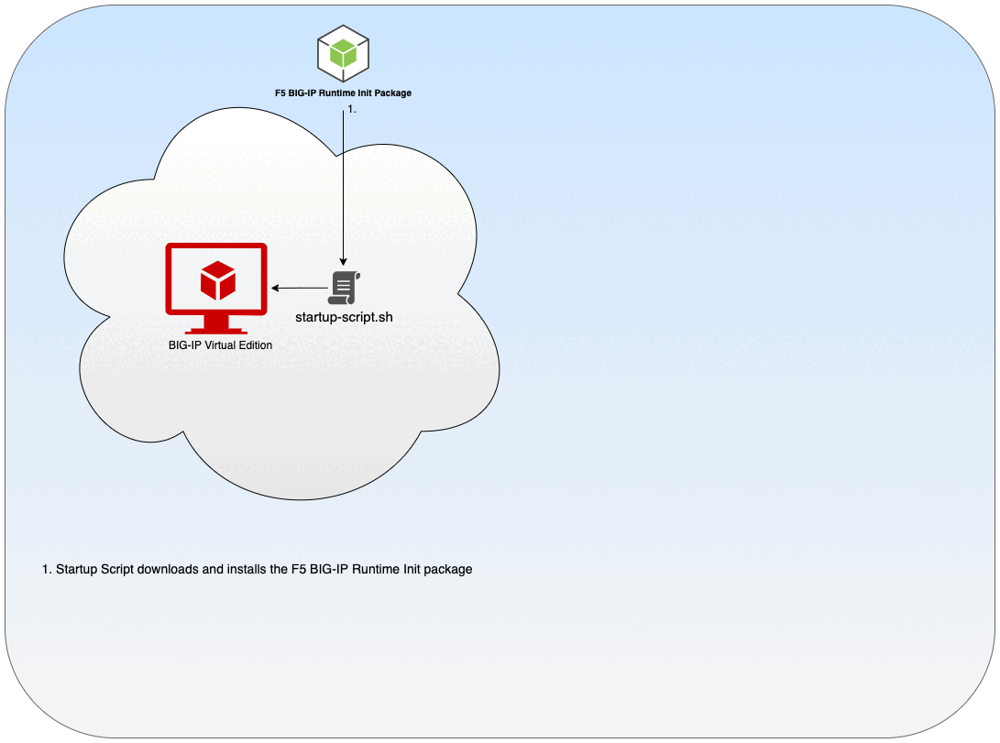

# F5 BIG-IP Runtime Init

[](https://github.com/f5networks/f5-bigip-runtime-init/releases)
[](https://github.com/f5networks/f5-bigip-runtime-init/issues)

## Contents
- [F5 BIG-IP Runtime Init](#big-ip-runtime-init)
  - [Contents](#contents)
  - [Introduction](#introduction)
  - [Overview](#overview)
  - [Features](#features)
  - [Prerequisites](#prerequisites)
  - [Caveats and Limitations](#caveats-and-limitations)
  - [Validated BIG-IP versions](#validated-big-ip-versions)
  - [Installer](#installer)
  - [Downloads](#downloads)
  - [Configuration](#configuration)
    - [Configuration Examples and Schema Documentation](#configuration-examples-and-schema-documentation)
    - [controls](#controls)
    - [pre_onboard_enabled](#pre\_onboard\_enabled)
    - [runtime_parameters](#runtime\_parameters)
    - [bigip_ready_enabled](#bigip\_ready\_enabled)
    - [extension_packages](#extension\_packages)
    - [extension_services](#extension\_services)
    - [post_onboard_enabled](#post\_onboard\_enabled)
    - [post_hook](#post\_hook)
  - [Usage Examples](#usage-examples)
    - [Terraform](#terraform)
      - [Azure snippet](#azure-terraform-snippet)
    - [Azure (ARM Template) snippet](#azure-arm-template-snippet)
      - [Download BIG-IP Runtime Config from a URL](#download-big-ip-runtime-config-from-a-url)
      - [Inline BIG-IP Runtime Config](#inline-big-ip-runtime-config)
    - [Native Template Examples](#native-template-examples)
  - [Using a Proxy Server](#using-a-proxy-server)
  - [Private Environments](#private-environments)
      - [Disable Calls from the Installer](#disable-calls-from-the-installer)
      - [Disable Calls from the Command](#disable-calls-from-the-command)
  - [Troubleshooting](#troubleshooting)
    - [Set Recommended System Database Variables](#set-recommended-system-database-variables)
    - [Log to the Serial Console](#log-to-the-serial-console)
    - [F5 Automation Toolchain Components](#f5-automation-toolchain-components)
    - [Extension metadata file](#extension-metadata-file)
  - [Documentation](#documentation)
  - [Getting Help](#getting-help)
    - [Filing Issues](#filing-issues)
  - [Copyright](#copyright)
  - [License](#license)
      - [Apache V2.0](#apache-v20)


## Introduction

F5 BIG-IP Runtime Init is a tool that aims to simplify startup scripts for BIG-IP Virtual Edition. It does this by providing a single convenient YAML (1.2 spec) or JSON-based configuration file, which
* leverages [F5 Automation Tool Chain](https://www.f5.com/pdf/products/automation-toolchain-overview.pdf) declarations that are easier to author, validate, and maintain as code (vs. bigip.conf files);
* renders secrets from public cloud vaults; and
* renders runtime variables from metadata services.

The result is a complete overlay deployment tool for configuring a BIG-IP instance. This allows us to extend our cloud solutions from native templates to other instance provisioning tools, such as Terraform and Ansible. For more information regarding sending startup scripts to BIG-IP VE, see [VE documentation](https://clouddocs.f5.com/cloud/public/v1/shared/cloudinit.html).




    
## Overview

From a high-level, using this tool involves three steps:

- **Step 1**: Download and Install BIG-IP Runtime Init using the self-extracting installer: 
  ```sh
  curl -o /tmp/f5-bigip-runtime-init-2.0.3-1.gz.run https://cdn.f5.com/product/cloudsolutions/f5-bigip-runtime-init/v2.0.3/dist/f5-bigip-runtime-init-2.0.3-1.gz.run && bash /tmp/f5-bigip-runtime-init-2.0.3-1.gz.run -- '--cloud [aws|azure|gcp]'
  ```
  - See [installer](#installer) details and [downloads](#downloads) below.

- **Step 2**: Download OR Render inline a Runtime Init configuration file (runtime-init-conf.yaml).
  ```sh
  curl -o /config/cloud/runtime-init-conf.yaml https://my-source-host/my-repo/bigip-configs/0.0.1/runtime-init-conf.yaml 
  ```
  - See [configuration](#configuration) details below.

- **Step 3**: Load the configuration file: 
  ```sh
  f5-bigip-runtime-init --config-file /config/cloud/runtime-init-conf.yaml
  ```

  - See usage [examples](#usage-examples) below.

## Features
This repository includes both the BIG-IP Runtime Init source code and a self-extracting installer script for installing the main package.

The installer script will do the following:

- Determine the cloud environment where the script is running
- Extract and verify the appropriate cloud-specific package archive
- Install the package archive and create a command alias for f5-bigip-runtime-init

Based on the content of the provided YAML or JSON configuration file, BIG-IP Runtime Init will do the following:

- Download, verify, and install F5 Automation Toolchain packages (DO, AS3, FAST, TS, and CFE) from default package metadata, URLs, or local files.
- Download, verify, and install custom iApp LX packages from URLs or local files.
- Accept Automation Toolchain declarations from URLs or local files (must be valid JSON or YAML declarations).
- Get secrets from cloud provider secret management APIs (Azure KeyVault, AWS Secret Manager, GCP Secrets Manager, HashiCorp Vault).
- Get select attributes from cloud provider instance and network metadata.
- Render valid Automation Toolchain declarations based on rendered runtime variables (such as secrets and metadata attributes above) and provided declarations.
- POST rendered declarations to Automation Toolchain endpoints and verify success or failure.
- Run user-specified pre-onboard and post-onboard commands.
- Send a webhook with a customizable telemetry data to a user-specified endpoint.


## Prerequisites
- BIG-IP 14.1.4.6 or newer.
- A mechanism to copy the configuration file to the BIG-IP instance (cloud-init, user data, provider-specific methods).
- Access to the Internet (or other network location if files are locally hosted) for downloading the self-extracting installer package, RPM files, and SHA256 checksums for package verification.
- Access to the cloud provider metadata service if you rendering metadata runtime parameters.
- An IAM identity associated to the BIG-IP instance(s) with sufficient roles/permissions for accessing cloud provider APIs.


## Caveats and Limitations
- If leveraging the `extension_services` parameter to send DO declarations, the declarations cannot contain directives that will trigger a reboot. For example, a reboot would occur for any declaration that:
  - contains a disk_class
  - provisions a module (for example, APM) that creates a disk volume

## Validated BIG-IP versions
F5 BIG-IP Runtime Init has been tested and validated with the following versions of BIG-IP:

| BIG-IP Version | Build Number |
| --- | --- |
| 16.1.3.3 | 0.0.3 |
| 15.1.8.1 | 0.0.3 |
| 14.1.5.3 | 0.0.5 |

Newer versions are expected to work but have not been specifically tested. 

## Installer

The self-extracting installer accepts the following parameters:

```
--cloud  | -c                   : Specifies cloud provider name. Allowed values: (aws, azure or gcp)
--key    | -k                   : Provides location for GPG key used for verifying signature on RPM file
--skip-verify                   : Disables RPM signature verification
--toolchain-metadata-file-url   : Provides overriding delivery URL for toolchain extension metadata file
--skip-toolchain-metadata-sync  : Disables downloading automation toolchain metadata from the Internet
--telemetry-params              : Specifies telemetry parameters as key:value pairs; (key01:value01,key02:value02). For sending F5 additional usage data.
```


*NOTE*: Runtime Init can be installed generically on a cloud or environment not listed above by omitting the ``--cloud | -c`` parameter. For example, it can also be used in a VMware environment to install the F5 Automation Tool Chain packages and declarations. When omitted, Runtime Init's cloud specific integrations (runtime_parameters: ```type: secret``` and ```type: metadata``` ) will be disabled. See [runtime_parameters](#runtime\_parameters) section for details.


The installer also allows you to configure request retries to make the installation robust and tolerant to network instability. This can be done using the following environment variables:

| Environment variable | Description | Default Value |
| --- | --- | --- |
| HTTP_RETRY | Number of retries before script will fail. | 12 |
| HTTP_RETRY_MAX_TIME | The retry timer (in seconds) is reset before the first transfer attempt. | 60 |
| HTTP_MAX_TIME | Maximum time (in seconds) that you allow the whole operation to take. | 5 |


**Examples:**

Using `--cloud` parameter for basic Azure install:
```
 curl https://cdn.f5.com/product/cloudsolutions/f5-bigip-runtime-init/v2.0.3/dist/f5-bigip-runtime-init-2.0.3-1.gz.run -o f5-bigip-runtime-init-2.0.3-1.gz.run && bash f5-bigip-runtime-init-2.0.3-1.gz.run -- '--cloud azure'
```

See [Private Environments](#private-environments) section below for more install examples.

## Downloads
Self-extracting installer, RPMs, and file hashes are available from the following locations:

| Cloud | Type | Location |
| --- | --- | --- |
| All | Self-extracting installer | https://cdn.f5.com/product/cloudsolutions/f5-bigip-runtime-init/v2.0.3/dist/f5-bigip-runtime-init-2.0.3-1.gz.run |
| All | SHA256 | https://github.com/f5networks/f5-bigip-runtime-init/releases/download/2.0.3/f5-bigip-runtime-init-2.0.3-1.gz.run.sha256 |
| All | RPM | https://cdn.f5.com/product/cloudsolutions/f5-bigip-runtime-init/v2.0.3/dist/rpms/f5-bigip-runtime-init-all-2.0.3-1-signed.noarch.rpm |
| All | SHA256 | https://cdn.f5.com/product/cloudsolutions/f5-bigip-runtime-init/v2.0.3/dist/rpms/f5-bigip-runtime-init-all-2.0.3-1-signed.noarch.rpm.sha256 |
| AWS | RPM | https://cdn.f5.com/product/cloudsolutions/f5-bigip-runtime-init/v2.0.3/dist/rpms/f5-bigip-runtime-init-aws-2.0.3-1-signed.noarch.rpm |
| AWS | SHA256 | https://cdn.f5.com/product/cloudsolutions/f5-bigip-runtime-init/v2.0.3/dist/rpms/f5-bigip-runtime-init-aws-2.0.3-1-signed.noarch.rpm.sha256 |
| Azure | RPM | https://cdn.f5.com/product/cloudsolutions/f5-bigip-runtime-init/v2.0.3/dist/rpms/f5-bigip-runtime-init-azure-2.0.3-1-signed.noarch.rpm |
| Azure | SHA256 | https://cdn.f5.com/product/cloudsolutions/f5-bigip-runtime-init/v2.0.3/dist/rpms/f5-bigip-runtime-init-azure-2.0.3-1-signed.noarch.rpm.sha256 |
| GCP | RPM | https://cdn.f5.com/product/cloudsolutions/f5-bigip-runtime-init/v2.0.3/dist/rpms/f5-bigip-runtime-init-gcp-2.0.3-1-signed.noarch.rpm |
| GCP | SHA256 | https://cdn.f5.com/product/cloudsolutions/f5-bigip-runtime-init/v2.0.3/dist/rpms/f5-bigip-runtime-init-gcp-2.0.3-1-signed.noarch.rpm.sha256 |
| None | RPM | https://cdn.f5.com/product/cloudsolutions/f5-bigip-runtime-init/v2.0.3/dist/rpms/f5-bigip-runtime-init-base-2.0.3-1-signed.noarch.rpm |
| None | SHA256 | https://cdn.f5.com/product/cloudsolutions/f5-bigip-runtime-init/v2.0.3/dist/rpms/f5-bigip-runtime-init-base-2.0.3-1-signed.noarch.rpm.sha256 |


## Configuration

The BIG-IP Runtime Init configuration consists of the following attributes:

| Attribute | Default Value | Required |    Description | 
| --- | --- | --- | --- | 
| [controls](#controls) | none | No    | List of runtime controls settings. |
| [pre_onboard_enabled](#pre\_onboard\_enabled) | none | No   | List of commands to run that do not check if BIG-IP and MCPD are up and running. However, execution before BIG-IP is ready depends on cloud agent/download times/etc.  |
| [runtime_parameters](#runtime\_parameters) | none | No    | List of runtime parameters to gather. |
| [bigip_ready_enabled](#bigip\_ready\_nabled) | none | No   | List of commands to run after BIG-IP and MCPD are up and running. Example: TMSH commands, misc optimizations, etc. |
| [extension_packages](#extension\_packages)    | none  | No | List of iControl Lx packages to download and install. |
| [extension_services](#extension\_ervices) | none | No |  List of iControl Lx declarations to configure. |
| [post_onboard_enabled](#post\_onboard\_enabled) | none   | No    | List of commands to run after sending iControl LX declarations. |
| [post_hook](#post\_hook) | none | No  | Webhook to send upon completion. |

#### Configuration Examples and Schema Documentation

A basic Runtime Init configuration file *(YAML)*.

```yaml
controls:
  logLevel: silly
  logFilename: /var/log/cloud/bigIpRuntimeInit.log
extension_packages:
  install_operations:
    - extensionType: do
      extensionVersion: 1.44.0
    - extensionType: as3
      extensionVersion: 3.51.0
    - extensionType: ts
      extensionVersion: 1.35.0
    - extensionType: fast
      extensionVersion: 1.25.0
```

See [SCHEMA.md](https://github.com/F5Networks/f5-bigip-runtime-init/blob/main/SCHEMA.md) for complete schema documentation and [/examples/runtime_configs](examples/runtime_configs/) for additional examples.

### controls

Runtime Init provides a list of controls intended for tuning Runtime Init execution as well as helping with troubleshooting issues: 

*NOTE:* These can also be set at runtime using an environment variable. For example:

```bash
export F5_BIGIP_RUNTIME_INIT_LOG_LEVEL=silly &&  f5-bigip-runtime-init --config-file /config/cloud/runtime-init-conf.yaml
```

  - **logLevel** 
    - *Description:* Defines log level. Allowed values are `error`, `warn`, `info`, `debug` and `silly`. *NOTE: F5 recommends putting Runtime Init in `silly` first. Although this results in large amounts of logs, it is generally more useful for troubleshooting initial deployments / new configurations.*
    - *Default:* `info`. 
    - *Environment Variable:* F5_BIGIP_RUNTIME_INIT_LOG_LEVEL (string)

- **logFilename**

   - *Description:* Defines the location of Runtime Init's log file. 
   - *Default:* `/var/log/cloud/bigIpRuntimeInit.log`
   - *Environment Variable:* F5_BIGIP_RUNTIME_INIT_LOG_FILENAME (string) 


 - **logToJson** 
    - *Description:* Defines when log is outputted into JSON format. For example,
    ```json
        {"message":"this is a json message","level":"info","timestamp":"2020-08-04T00:22:28.069Z"}
    ```
    - *Default:* `false`
    - *Environment Variable:* F5_BIGIP_RUNTIME_INIT_LOG_TO_JSON (boolean)


 - **extensionInstallDelayInMs** 
    - *Description:* Defines a delay between extensions installations. *NOTE: If not provided and the extension package is already installed, the default delay of 10 seconds is skipped.*
    - *Default:* `10000`
    - *Environment Variable:* F5_BIGIP_RUNTIME_EXTENSION_INSTALL_DELAY_IN_MS (number)


***Examples:***

```yaml
controls:
  logLevel: silly
  logFilename: /var/log/cloud/bigIpRuntimeInit.log
  logToJson: true
  extensionInstallDelayInMs: 60000
```


### pre_onboard_enabled

*Description:* A list of commands that run without checking if BIG-IP and MCPD are up and running. Whether these commands are executed before or after BIG-IP is ready depends on external factors like cloud agent status, network latency, etc. For instance, when the Runtime-Init installer and/or other required files are baked directly into the BIG-IP image using the [BIG-IP Image Generator](https://github.com/f5devcentral/f5-bigip-image-generator/), pre_onboard_enabled commands can run sufficiently early. However, in some clouds or scenarios, the files may take too long to download. In that case, these commands may need to be run earlier in the startup script itself to ensure they are applied before BIG-IP is ready.

Allowed types are `inline`, `file` and `url`.

***Examples:***

 - **inline** 

    ```yaml
    pre_onboard_enabled:
      - name: example_inline_command
        type: inline
        commands:
          - touch /tmp/pre_onboard_script.sh
          - chmod 777 /tmp/pre_onboard_script.sh
          - echo "touch /tmp/create_by_autogenerated_pre_local" > /tmp/pre_onboard_script.sh
          - /usr/bin/setdb provision.extramb 1000 || exit 0
          - /usr/bin/setdb provision.restjavad.extramb 1384 || /usr/bin/setdb restjavad.useextramb true || exit 0
          - /usr/bin/setdb iapplxrpm.timeout 300 || exit 0
          - /usr/bin/setdb icrd.timeout 180 || exit 0
          - /usr/bin/setdb restjavad.timeout 180 || exit 0
          - /usr/bin/setdb restnoded.timeout 180 || exit 0
    ```

 - **file** 

    ```yaml
    pre_onboard_enabled:
      - name: example_local_exec
        type: file
        commands:
          - /tmp/pre_onboard_script.sh
    ```

 - **url** 

    ```yaml
    pre_onboard_enabled:
      - name: example_remote_exec
        type: url
        commands:
          - https://the-delivery-location.com/remote_pre_onboard.sh
    ```


*NOTE:* Each command is executed independently from each other. For example, a bash variable in one command cannot be referenced by the following command. See the other command based attributes (ex. [bigip_ready_enabled](#bigip\_ready\_enabled), [post_onboard_enabled](#post\_onboard\_enabled) for more advanced command examples.


### runtime_parameters

*Description:* A list of parameters discovered at run (or deploy) time which are substituted *(using mustache handlebars)* in subsequent eligible runtime attributes: 
* bigip_ready_enabled *(commands)*
* extension_packages
* extension_services *(declarations sent to the Tool Chain endpoints)* 
* post_onboard_enabled: *(commands)*
* post_hook

Parameters can be dependent on each other, so one parameter value can be used within another parameter (see examples below for more details).

Allowed types are `storage`, `secret`, `tag`, `metadata`, `url` and `static`.

 - **storage**

    *Description:* fetches a file from cloud or other storage and renders the result as a parameter value. Storage parameter files are downloaded before other runtime parameters are processed.
    
    The example below demonstrates how to fetch the values for the downloads from Amazon S3, Azure Blob Storage, Google Cloud Storage, or another location.

    *NOTE*: Storage provider destinations may ***only*** start with either */var/config/rest/downloads* or */var/tmp*. Large files such as RPMs must be saved in /var/config/rest/downloads. When a file saved in /var/config/rest/downloads is referenced by its parameter name, the parameter value will be rendered as a local file path on the BIG-IP instance. Files saved to /var/tmp will be rendered as a string or JSON, depending on the format of the response.

    ***Examples:***

    ```yaml
    runtime_parameters:
      - name: AWS_TO_FILE
        type: storage
        storageProvider:
          environment: aws
          source: https://mybucket.s3.amazonaws.com/mykey/f5-appsvcs-3.42.0-5.noarch.rpm
          destination: "/var/config/rest/downloads/f5-appsvcs-3.42.0-5.noarch.rpm"
      - name: AWS_TO_FILE_2
        type: storage
        storageProvider:
          environment: aws
          source: s3://mybucket/mykey/asm-policy-v0.0.1.xml
          destination: /var/config/rest/downloads/asm-policy-v0.0.1.xml
      - name: AWS_TO_PARAMETER
        type: storage
        storageProvider:
          environment: aws
          source: s3://mybucket/mykey/myfile
          destination: "/var/tmp/myfile"
      - name: AZURE_TO_FILE
        type: storage
        storageProvider:
          environment: azure
          source: https://mystorageaccount.blob.core.windows.net/mycontainer/f5-appsvcs-3.42.0-5.noarch.rpm
          destination: "/var/config/rest/downloads/f5-appsvcs-3.42.0-5.noarch.rpm"
      - name: AZURE_TO_PARAMETER
        type: storage
        storageProvider:
          environment: azure
          source: https://mystorageaccount.blob.core.windows.net/mycontainer/myfile
          destination: "/var/tmp/myfile"
      - name: GCP_TO_FILE
        type: storage
        storageProvider:
          environment: gcp
          source: https://storage.cloud.google.com/mybucket/mykey/f5-appsvcs-3.42.0-5.noarch.rpm
          destination: "/var/config/rest/downloads/f5-appsvcs-3.42.0-5.noarch.rpm"
      - name: GCP_TO_PARAMETER
        type: storage
        storageProvider:
          environment: gcp
          source: gs://mybucket/mykey/myfile
          destination: "/var/tmp/myfile"
      - name: PRIVATE_TO_FILE
        type: storage
        storageProvider:
          environment: private
          source: https://github.com/F5Networks/f5-appsvcs-extension/releases/download/v.3.42.0/f5-appsvcs-3.42.0-5.noarch.rpm
          destination: "/var/config/rest/downloads/f5-appsvcs-3.42.0-5.noarch.rpm"
      - name: PRIVATE_TO_PARAMETER
        type: storage
        storageProvider:
          environment: private
          source: https://myserver/myfile
          destination: "/var/tmp/myfile"
    ```

    **Referencing storage provider parameter values - S3**
    
    In this example, the AWS_TO_FILE parameter is renderered as "/var/config/rest/downloads/f5-appsvcs-3.42.0-5.noarch.rpm"; to reference this as a local file URL you must prepend "file://" to the parameter name:
    ```yaml
    extension_packages:
      install_operations:
        - extensionType: as3
          extensionVersion: 3.42.0
          extensionUrl: 'file://{{{AWS_TO_FILE}}}'
    ```

    In this example, the AWS_TO_FILE_2 parameter is renderered as "/var/config/rest/downloads/asm-policy-v0.0.1.xml":
    ```yaml
    extension_services:
      service_operations:
        - extensionType: as3
          type: inline
          value:
            class: ADC
            schemaVersion: 3.0.0
            label: Quickstart
            remark: Quickstart
            Tenant_1:
              class: Tenant
              Shared:
                class: Application
                template: shared
                shared_pool:
                  class: Pool
                  remark: Service 1 shared pool
                  members:
                    - serverAddresses:
                        - 10.0.3.4
                      servicePort: 80
                  monitors:
                    - http
                Custom_HTTP_Profile:
                  class: HTTP_Profile
                  xForwardedFor: true
                Custom_WAF_Policy:
                  class: WAF_Policy
                  file: >-
                    '{{{AWS_TO_FILE_2}}}'
                  enforcementMode: blocking
                  ignoreChanges: false
    ```

    In this example, the AWS_TO_PARAMETER parameter is renderered as either a string or JSON object, depending on the original file format:
    ```yaml
    post_onboard_enabled:
      - name: echo_downloaded_file
        type: inline
        commands:
          - echo "Downloaded file parameter is {{{AWS_TO_PARAMETER}}}" # renders content of s3://mybucket/mykey/myfile
          - echo "Downloaded JSON parameter is {{{AWS_TO_PARAMETER.key}}}" # renders value of "key" key in s3://mybucket/mykey/myfile
    ```

    *NOTE:*
    - In AWS and GCP, both https:// and **global** s3:// and gs:// source URLs are supported.
    - In Azure, only blob storage URLs are supported.
    - The IAM roles/RBAC permissions required for downloading objects from cloud provider storage are listed below. Minimally, these permissions must be scoped to the storage resource.

      * AWS:
        ```text
          "s3:ListBucket"
          "s3:GetObject"
        ```
      * Azure:
        ```text
          "Microsoft.Authorization/*/read"
          "Microsoft.Storage/storageAccounts/read"
          "Microsoft.Storage/storageAccounts/blobServices/containers/blobs/read"
          "Microsoft.Storage/storageAccounts/listKeys/action"
        ```
      * GCP (Labels):
        ```text
          "storage.buckets.get"
          "storage.buckets.list"
          "storage.objects.get"
          "storage.objects.list"
        ```    

 - **secret** 
  
    *Description:* Fetches a secret from a provider vault. This type requires the BIG-IP instance to have IAM **READ** permissions for the secrets. See the respective Cloud Provider's official documentation for additional information. For basic examples, see the [Terraform examples](examples/terraform). 

    Allowed environments are `aws`, `azure`, `gcp` and `hashicorp`.

    ***Examples:***

    **AWS:**

    *Provide secret name (assumes secret is in same region as BIG-IP instance):*
    ```yaml
    runtime_parameters:
      - name: ADMIN_PASS
        type: secret
        secretProvider:
          type: SecretsManager
          environment: aws
          version: AWSCURRENT
          secretId: mysecret
    ```

    *Provide secret ARN, including 12 digit account ID and region:*
    ```yaml
    runtime_parameters:
      - name: ADMIN_PASS
        type: secret
        secretProvider:
          type: SecretsManager
          environment: aws
          version: AWSCURRENT
          secretId: arn:aws:secretsmanager:us-east-1:123456789012:secret:mySecretId-a0BCDE
    ```
    
    **IAM Permissions:**
    ```text
      "secretsmanager:GetSecretValue",
      "secretsmanager:DescribeSecret",
      "secretsmanager:ListSecretVersionIds"
    ```
    *For more information, see [AWS documentation](https://docs.aws.amazon.com/mediaconnect/latest/ug/iam-policy-examples-asm-secrets.html).*
    </br>

    **Azure:**
    ```yaml
    runtime_parameters:
      - name: AZURE_SERVICE_PRINCIPAL
        type: secret
        secretProvider:
          type: KeyVault
          environment: azure
          vaultUrl: https://my-keyvault.vault.azure.net
          secretId: mysecret
    ```
    **IAM Permissions:**
    ```text
    key_permissions = ["get"]
    secret_permissions = ["get","list"]
    storage_permissions = ["get"]
    ```
    *For more information, see [Azure KeyVault access control policy documentation](https://docs.microsoft.com/en-us/azure/key-vault/secrets/about-secrets#secret-access-control).*

    **KeyVault Firewall:**
    If Azure KeyVault Firewall is enabled and the default firewall action is Deny, you must explicitly add either the Azure public management IP address of the BIG-IP instance, or the Azure virtual network and management subnet, to the KeyVault Firewall allow list.

    *For more information, see [Azure KeyVault network security documentation](https://learn.microsoft.com/en-us/azure/key-vault/general/network-security).*
    </br>

    **GCP:**

    *Provide secret name (assumes secret is in same project as BIG-IP instance):*
    ```yaml
    runtime_parameters:
      - name: ADMIN_PASS
        type: secret
        secretProvider:
          type: SecretsManager
          environment: gcp
          version: latest
          secretId: mysecret
    ```

    *Provide fully-qualified secret identifier, including project number and version:*
    ```yaml
    runtime_parameters:
      - name: ADMIN_PASS
        type: secret
        secretProvider:
          type: SecretsManager
          environment: gcp
          secretId: projects/123456789/secrets/mysecret/versions/latest
    ```

    **IAM Permissions:**
    ```text
    "secretmanager.versions.access"
    "secretmanager.versions.list"
    "secretmanager.versions.get"
    "compute.instances.get"
    ```
    *For more information, see [GCP documentation](https://cloud.google.com/secret-manager/docs/access-control).*
    </br>    

    **HashiCorp (using App Role authentication):**

    The following example uses the special value **data** in the field attribute to retrieve the entire secret response, which can then be referenced inside mustache handlebars inside the configuration. When referencing multiple secret values from a single response, this limits client requests to the Vault server to a minimum (you may also create a unique runtime parameter for each secret stored in Vault, using the provided examples). 

    ```yaml
    runtime_parameters:
      - name: ADMIN_PASS
        type: secret
        verifyTls: true
        trustedCertBundles: ['/config/ssl/ssl.crt/my-ca-bundle.crt']
        secretProvider:
          type: Vault
          environment: hashicorp
          vaultServer: https://127.0.0.1:8200
          appRolePath: /v1/auth/approle/login
          secretsEngine: kv2
          secretId: secret/credential
          field: data
          version: 1
          authBackend:
            type: approle
            roleId:
              type: url
              value: file:///path/to/role-id
            secretId:
              type: inline
              value: secret-id
              unwrap: true
    ...
    extension_services:
      service_operations:
        - extensionType: do
          type: inline
          value: 
            schemaVersion: 1.0.0
            class: Device
            async: true
            label: my BIG-IP declaration for declarative onboarding
            Common:
              class: Tenant
              hostname: '{{{ HOST_NAME }}}.local'
              foo:
                class: User
                userType: regular
                password: '{{{ ADMIN_PASS.foo_password }}}'
                shell: bash
                partitionAccess:
                  all-partitions:
                    role: admin
              bar:
                class: User
                userType: regular
                password: '{{{ ADMIN_PASS.bar_password }}}'
                shell: bash
                partitionAccess:
                  all-partitions:
                    role: admin
    ```

    *NOTE*: 
    - When the authBackend.secretId.unwrap attribute is set to `true` (recommended), the secretId value must be in the form of a wrapping token. BIG-IP Runtime Init will unwrap this token to retrieve the actual secret ID. This eliminates the need to pass the secret ID in the declaration. For more information, See the [HashiCorp AppRole documentation](https://learn.hashicorp.com/tutorials/vault/approle-best-practices#approle-response-wrapping)

    - This example also demonstrates how to use custom PKI certs for https requests to HashiCorp Vault server when verifyTls set to `true`. 
    <br>

    *For more information, see [HashiCorp documentation](https://www.vaultproject.io/docs/concepts/policies#policy-syntax).*
    <br>

    ##### Security - Masking Secrets

    By default, runtime will mask out (ex. \"password\":\"******\") the following common fields in declarations when logging:

    ```json
        [
            "password",
            "localPassword",
            "remotePassword",
            "bigIqPassword",
            "bigIpPassword",
            "passphrase",
            "cookiePassphrase",
            "certificate",
            "privateKey",
            "ciphertext",
            "protected",
            "secret",
            "sharedSecret",
            "secretAccessKey",
            "apiAccessKey",
            "encodedCredentials",
            "encodedToken",
            "oldPassword",
            "newPassword",
            "bindPassword",
            "checkBindPassword",
            "md5SignaturePassphrase"
        ]
    ```
    However, it is possible to extend this list by providing an additional (***field***) attribute for the Secret object:

    ```yaml
    runtime_parameters:
      - name: MY_SECRET
        type: secret
        secretProvider:
          environment: azure
          type: KeyVault
          vaultUrl: https://my-keyvault.vault.azure.net
          secretId: mySecret01
          field: newCustomSecretField
    ``` 

    This example shows instructing Runtime Init to also mask out the value for ```newCustomSecretField``` seen in any declarations.

 - **tag**

    *Description:* fetches a tag value from public cloud virtual machine resource. 
    
    The example below demonstrates how to fetch the value for the tag, with the key "CustomTag", applied to the EC2 instance: 
      
    ```yaml
    runtime_parameters:
      - name: TAG_VALUE
        type: tag
        tagProvider:
          environment: aws
          key: CustomTag
    ```

    *NOTE:*
    - In Azure, Runtime-Init will gather tags from the metadata service and doesn't require any additional permissions.
    - In AWS and GCP, Runtime-Init will gather them from the Cloud API which requires additional IAM permissions.


      * AWS:

        ```text
          "ec2:DescribeTags"
        ```
      * GCP (Labels):

        ```text
          "compute.instances.get"
        ```    
        * GCP also has several different types of tags (Labels, Network Tags, and Metadata Tags - ad hoc key/value pairs embedded in Metadata). As the Metadata Tags can be fetched using the generic `url` type if needed, this type leverages IAM roles to enable fetching "Labels".

 - **metadata**

    *Description:* Convenience function to grab common onboarding items from the Metadata Service. 

    Allowed types are `network` and `uri`.

    For example, type `network` returns addresses reformatted in CIDR notation so you can use for Self-IPs.

    For more examples, see the [examples/runtime_configs](examples/runtime_configs/snippets) directory

    ***Examples:***

    *AWS Self-IP*
    ```yaml
    runtime_parameters:
      - name: SELF_IP_EXTERNAL
        type: metadata
        metadataProvider:
          type: network
          environment: aws
          field: local-ipv4s
          index: 1
    ```

    *Azure Self-IP*
    ```yaml
    runtime_parameters:
      - name: SELF_IP_EXTERNAL
        type: metadata
        metadataProvider:
          type: network
          environment: azure
          field: ipv4
          index: 1
      - name: SELF_IP_EXTERNAL_IPV6
        type: metadata
        metadataProvider:
          type: network
          environment: azure
          field: ipv6
          index: 1
    service_operations:
      - extensionType: do
        value:
          Common:
            class: Tenant
            external-self:
              class: SelfIp
              address: '{{{SELF_IP_EXTERNAL}}}'
              vlan: external
            external-self-ipv6:
              class: SelfIp
              address: '{{{SELF_IP_EXTERNAL_IPV6}}}/64'
              vlan: external
    ```

    *GCP Self-IP*
    ```yaml
    runtime_parameters:
      - name: SELF_IP_EXTERNAL
        type: metadata
        metadataProvider:
          environment: gcp
          type: network
          field: ip
          index: 0
    ```

    IPv4: Returns the CIDR address (ex. `10.0.0.5/24`) which is required by the Self-IP.
    IPv6: Returns the address (ex. ab:ff:ff::dfd). Must provide the prefix.

    The output can be further transformed using ipcalc functionality (IPv4 only):


    The ipcalc functionality provides the following transformation options: 
      - **address**   - The provided address without netmask prefix.
      -  **base**      - The base address of the network block as a string (eg: 216.240.32.0). Base does not give an indication of the size of the network block.
      -  **mask**      - The netmask as a string (eg: 255.255.255.0).
      -  **hostmask**  - The host mask which is the opposite of the netmask (eg: 0.0.0.255).
      -  **bitmask**   - The netmask as a number of bits in the network portion of the address for this block (eg: 24).
      -  **size**      - The number of IP addresses in a block (eg: 256).
      -  **broadcast** - The blocks broadcast address (eg: 192.168.1.0/24 => 192.168.1.255).
      -  **first**     - First useable address.
      -  **last**      - Last useable address.


    The following example uses ipcalc to get the first useable IPv4 address using the CIDR of the first AWS subnet and resolves it to a runtime parameter named `GATEWAY`.

    ```yaml
    runtime_parameters:
      - name: GATEWAY
        type: metadata
        metadataProvider:
          environment: aws
          type: network
          field: local-ipv4s
          index: 0
          ipcalc: first
    ```
    This example returns `10.0.0.1` for the Self-IP `10.0.0.5/24`.

    The next example uses ipcalc to get the bitmask using the CIDR of the first AWS subnet and resolves it to a runtime parameter named as BITMASK.
          
    ```yaml
    runtime_parameters:
      - name: BITMASK
        type: metadata
        metadataProvider:
          environment: aws
          type: network
          field: local-ipv4s
          index: 0
          ipcalc: bitmask
    ```
    This example returns `24` for the Self-IP `10.0.0.5/24`.
            
    For fetching **AWS** Metadata, Runtime Init allows you use a custom URI. By default, Runtime Init uses AWS IMDSv2 to get AWS metadata:

    ```yaml
    runtime_parameters:
      - name: ACCOUNT_ID
        type: metadata
        metadataProvider:
          environment: aws
          type: uri
          value: /latest/dynamic/instance-identity/document
          query: accountId
    ```    

    In the case where JSON response is returned, this type allows you to provide a [JMESPath](https://jmespath.org/) query filter. In example above, the response queries for the `accountId` key. 

 - **url**

    *Description:* Defines a generic URL to fetch a runtime parameter. 

    This type can be useful when gathering custom metadata not covered in the `metadataProvider` above, data from custom locations, session based URLs, etc.

    This type allows you to provide HTTP headers as well as a [JMESPath](https://jmespath.org/) query filter for JSON responses. The headers and query fields are *optional*. 

    <br/>
    The following examples demonstrates how to fetch hostnames or virtual machine names for AWS, GCP and Azure:

    *AWS Hostname*
    ```yaml
    runtime_parameters:
      - name: HOST_NAME
        type: url
        value: http://169.254.169.254/latest/meta-data/hostname
    ```

    *GCP Hostname*
    ```yaml
    runtime_parameters:
      - name: HOST_NAME
        type: url
        value: http://169.254.169.254/computeMetadata/v1/instance/hostname
        headers:
          - name: Metadata-Flavor
            value: Google
    ```

    *Azure Virtual Machine Name*
    ```yaml
    runtime_parameters:
      - name: NAME
        type: url
        value: 'http://169.254.169.254/metadata/instance/compute?api-version=2020-09-01'
        query: name
        headers:
          - name: Metadata
            value: true
    ```

   The following AWS URL example has been superseded by the metadata `uri` type above but demonstrates linking Runtime Parameters together (to provide a session-based request). It first fetches an AWS Session token and leverages the JMESPath `query` field to filter for the `region` key. 

    AWS:

    ```yaml
    runtime_parameters:  
      - name: AWS_SESSION_TOKEN
        type: url
        value: http://169.254.169.254/latest/api/token
        headers:
          - name: Content-Type
            value: json
          - name: User-Agent
            value: some-user-agent
          - name: method
            value: PUT
          - name: X-aws-ec2-metadata-token-ttl-seconds
            value: 21600
      - name: REGION
        type: url
        value: http://169.254.169.254/latest/dynamic/instance-identity/document
        query: region
        headers:
          - name: Content-Type
            value: json
          - name: User-Agent
            value: some-user-agent
          - name: X-aws-ec2-metadata-token
            value: "{{{AWS_SESSION_TOKEN}}}"
    ```

    The `url` type also allows you to provide a local file location using the "file://" schema. The example below demonstrates how to get a parameter value from the /config/cloud/paramter-file.txt file:
      
    ```yaml
    runtime_parameters:
      - name: SOME_PARAM
        type: url
        value: file:///config/cloud/paramter-file.txt 
    ```      


 - **static**

    *Description:* defines a static value. 

    Examples: 

    This example replaces AVAILABILITY_ZONE token with "us-west-2a" string.

    ```yaml
    runtime_parameters:
      - name: AVAILABILITY_ZONE
        type: static
        value: us-west-2a
    ```

### bigip_ready_enabled

*Description:* List of commands to run after BIG-IP and MCPD are up and running. Example: TMSH commands, misc optimizations, etc.

Allowed types are `inline`, `file` and `url`.

***Examples:***

 - **inline** 

    ```yaml
    bigip_ready_enabled:
    # Dependent on GUI being up
      - name: icontrol_settings
        type: inline
        commands:
          - '/usr/bin/curl -s -f -u admin: -H "Content-Type: application/json" -d ''{"maxMessageBodySize":134217728}'' -X POST http://localhost:8100/mgmt/shared/server/messaging/settings/8100 | jq .'
    # Dependent on MCPD being up
      - name: using_runtime_variables
        type: inline
        commands:
          - f5mku -r {{{ ADMIN_PASS }}}
    # Dependent on TMSH / MCPD being up
      - name: using_bash_variables_in_commands
        type: inline
        commands:
          - "EXT_GW=$(curl -sH 'Metadata-Flavor: Google' http://169.254.169.254/computeMetadata/v1/instance/network-interfaces/0/gateway); tmsh create net route ext_gw_int network $EXT_GW/32 interface external"
          - "INT_GW=$(curl -sH 'Metadata-Flavor: Google' http://169.254.169.254/computeMetadata/v1/instance/network-interfaces/2/gateway); tmsh create net route int_gw_int network $INT_GW/32 interface internal"
    ```


*NOTE:* Each command is executed in a separate shell context from each other. For example, a bash variable in one command cannot be referenced by the following command. For instance, in the example above, the command with the `$INT_GW` variable would not be able to render the `$EXT_GW` variable from command above it. For more examples, see the [examples/runtime_configs](examples/runtime_configs/snippets) directory.


### extension_packages

*Description:* List of iControl Lx packages to download and install.

Allowed extensionTypes are `do`, `as3`, `ts`, `fast` and `cfe`.

***Examples:***

 - *minimal* 

    ```yaml
    extension_packages:
      install_operations:
        - extensionType: do
          extensionVersion: 1.44.0
        - extensionType: as3
          extensionVersion: 3.51.0
        - extensionType: ts
          extensionVersion: 1.35.0
        - extensionType: fast
          extensionVersion: 1.25.0
    ```

 - *with hash checking*

    ```yaml
    extension_packages:
      install_operations:
        - extensionType: do
          extensionVersion: 1.44.0
          extensionHash: 3b05d9bcafbcf0b5b625ff81d6bab5ad26ed90c0dd202ded51756af3598a97ec
        - extensionType: as3
          extensionVersion: 3.51.0
          extensionHash: e151a9ccd0fd60c359f31839dc3a70bfcf2b46b9fedb8e1c37e67255ee482c0f
        - extensionType: ts
          extensionVersion: 1.35.0
          extensionHash: 839698d98a8651a90b3d509cde4b382338461a253878c9fd00c894699ef0e844
        - extensionType: fast
          extensionVersion: 1.25.0
          extensionHash: 434309179af405e6b663e255d4d3c0a1fd45cac9b561370e350bb8dd8b39761f
    ```

 - *custom from URL*

    ```yaml
    extension_packages:
      install_operations:
      - extensionType: do
        extensionUrl: https://github.com/F5Networks/f5-declarative-onboarding/releases/download/v1.44.0/f5-declarative-onboarding-1.44.0-5.noarch.rpm
        extensionVersion: 1.44.0
      - extensionType: as3
        extensionUrl: file:///var/config/rest/downloads/f5-appsvcs-3.51.0-5.noarch.rpm
        extensionVersion: 3.51.0
      - extensionType: fast
        extensionUrl: https://github.com/F5Networks/f5-appsvcs-templates/releases/download/v1.25.0/f5-appsvcs-templates-1.25.0-1.noarch.rpm
        extensionVersion: 1.25.0     
    ```

    *NOTE: ```extensionVersion``` is not required when used with the ```extensionUrl``` field.*


For more examples, see the [examples/runtime_configs](examples/runtime_configs/snippets) directory.


### extension_services

*Description:* List of iControl Lx declarations to configure. 

Allowed extensionTypes are `do`, `as3`, `ts` and `cfe`.

Allowed value types are `inline` and `url`.

***Examples:***


 - **inline** 

    ```yaml
    extension_services:
      service_operations:
        - extensionType: do
          type: inline
          value:
            schemaVersion: 1.0.0
            class: Device
            label: >-
              Quickstart 1NIC BIG-IP declaration for Declarative Onboarding with BYOL
              license
            async: true
            Common:
              class: Tenant
              My_DbVariables:
                class: DbVariables
                ui.advisory.enabled: true
                ui.advisory.color: blue
                ui.advisory.text: BIG-IP Quickstart
              My_Provisioning:
                class: Provision
                asm: nominal
                ltm: nominal
              My_Ntp:
                class: NTP
                servers:
                  - 169.254.169.253
                timezone: UTC
              My_Dns:
                class: DNS
                nameServers:
                  - 169.254.169.253
              My_License:
                class: License
                licenseType: regKey
                regKey: 'AAAAA-BBBBB-CCCCC-DDDDD-EEEEEEE'
              My_System:
                class: System
                autoPhonehome: true
                hostname: bigip.example.com
              quickstart:
                class: User
                partitionAccess:
                  all-partitions:
                    role: admin
                password: 'BIGIP_PASSWORD'
                shell: bash
                userType: regular
        - extensionType: as3
          type: inline
          value:
            class: AS3
            action: deploy
            persist: true
            declaration:
              class: ADC
              schemaVersion: 3.0.0
              label: Sample 1
              remark: Simple HTTP Service with Round-Robin Load Balancing
              Sample_01:
                class: Tenant
                A1:
                  class: Application
                  template: http
                  serviceMain:
                    class: Service_HTTP
                    virtualAddresses:
                    - 10.0.1.10
                    pool: web_pool
                  web_pool:
                    class: Pool
                    monitors:
                    - http
                    members:
                    - servicePort: 80
                      serverAddresses:
                      - 192.0.1.10
                      - 192.0.1.11
    ```

 - **url** 

    ```yaml
    extension_services:
      service_operations:
        - extensionType: do
          type: url
          value: https://cdn.f5.com/product/cloudsolutions/declarations/template2-0/autoscale-waf/autoscale_do_payg.json
          verifyTls: false
        - extensionType: as3
          type: url
          value: file:///examples/automation_toolchain_declarations/as3.json
    ```

*NOTE:* 
 - *If using the `url` type, the declarations can be in JSON or YAML format.*

For more examples, see the [examples/runtime_configs](examples/runtime_configs/snippets) directory.

*TIP*:
 - If creating multiple service extension services, you may need to order them in a particular sequence. For example, if creating a cluster with Declarative Onboarding (DO) and additional extension services, run the first Declarative Onboarding declaration without the device service clustering elements, then run the additional services, and finally, the Declarative Onboarding declaration again with the clustering elements. 
 
 For examples, see `failover` solutions in the [Native Template Examples](#native-template-examples).


### post_onboard_enabled

*Description:* List of commands to run after sending iControl LX declarations.

Allowed types are `inline`, `file` and `url`.

***Examples:***

 - **inline** 

    ```yaml
    post_onboard_enabled:
      - name: example_inline_command
        type: inline
        commands:
          - touch /tmp/post_onboard_script.sh
          - chmod 777 /tmp/post_onboard_script.sh
          - echo "touch /tmp/create_by_autogenerated_post_local" > /tmp/post_onboard_script.sh
    ```


*NOTE:* Each command is executed independently from each other. For example, a bash variable in one command cannot be referenced by the following command. For more examples, see the [examples/runtime_configs](examples/runtime_configs/snippets) directory.

### post_hook

*Description:* Webhook to send upon completion.

***Examples:***

```yaml
post_hook:
  - name: example_webhook
    type: webhook
    url: https://webhook.site
    properties:
      optionalKey1: optional_value1
      optionalKey2: optional_value2
```

For more examples, see the [examples/runtime_configs](examples/runtime_configs/snippets) directory.


## Usage Examples
### Terraform

Terraform plans will generally consist of the following:

  - a startup_script template (.tpl)
  - passing the rendered startup script to the instance's startup script parameter 


#### Azure snippet

In this snippet: 

```
resource "azurerm_linux_virtual_machine" "vm" {
  name                  = "vm-${module.utils.env_unique_id}-bigip"
  resource_group_name   = azurerm_resource_group.rg.name
  location              = azurerm_resource_group.rg.location
  size                  = var.instance_size
  admin_username        = var.admin_username

  admin_ssh_key {
    username   = var.admin_username
    public_key = file(var.f5_ssh_publickey)
  }

 os_disk {
    caching              = "ReadWrite"
    storage_account_type = "Standard_LRS"
  }

  source_image_reference {
    publisher = var.publisher
    offer     = var.offer
    sku       = var.sku
    version   = var.bigip_version
  }

  plan {
    publisher = var.publisher
    product   = var.offer
    name      = var.sku
  }

  boot_diagnostics {
    storage_account_uri  = var.boot_diagnostics ? join(",", azurerm_storage_account.vm_sa.*.primary_blob_endpoint) : ""
  }

  network_interface_ids = [
      azurerm_network_interface.nic_mgmt.id, 
      azurerm_network_interface.nic_external.id, 
      azurerm_network_interface.nic_internal.id
  ]

  identity {
    type         = "UserAssigned"
    identity_ids = [azurerm_user_assigned_identity.user_identity.id]
  }

  custom_data = base64encode(templatefile("${path.module}/startup-script.tpl", {
    vault_name:         "key-vault-${module.utils.env_unique_id}-bigip",
    secret_id:          azurerm_key_vault_secret.adminsecret.name,
    package_url:        var.bigip_runtime_init_package_url,
    admin_username:     var.admin_username,
  }))

  tags = merge(var.global_tags, { Name="vm-${module.utils.env_unique_id}-bigip" })

}
```

The startup script is templatized in startup-script.tpl and sent using the VM's ```custom_data``` parameter. On BIG-IP versions 15.1+, Cloud-Init will execute this script directly. However, for earlier versions, azurerm_virtual_machine_extension is used to run it. See [BIG-IP Cloud-Init documentation](!https://clouddocs.f5.com/cloud/public/v1/shared/cloudinit.html) for more information.


The Terraform template for the startup script contains the following contents.

```sh
#!/bin/bash -x

# Send output to log file and serial console
mkdir -p  /var/log/cloud /config/cloud /var/config/rest/downloads
LOG_FILE=/var/log/cloud/startup-script.log
[[ ! -f $LOG_FILE ]] && touch $LOG_FILE || { echo "Run Only Once. Exiting"; exit; }
npipe=/tmp/$$.tmp
trap "rm -f $npipe" EXIT
mknod $npipe p
tee <$npipe -a $LOG_FILE /dev/ttyS0 &
exec 1>&-
exec 1>$npipe
exec 2>&1

# Download or Render BIG-IP Runtime Init Config
cat << 'EOF' > /config/cloud/runtime-init-conf.yaml
---
controls:
  logLevel: silly
  logFilename: /var/log/cloud/bigIpRuntimeInit.log
pre_onboard_enabled: []
runtime_parameters:
  - name: ADMIN_PASS
    type: secret
    secretProvider:
      environment: azure
      type: KeyVault
      vaultUrl: 'https://${vault_name}.vault.azure.net'
      secretId: ${secret_id}
  - name: HOST_NAME
    type: metadata
    metadataProvider:
      environment: azure
      type: compute
      field: name
  - name: SELF_IP_EXTERNAL
    type: metadata
    metadataProvider:
      environment: azure
      type: network
      field: ipv4
      index: 1
  - name: SELF_IP_INTERNAL
    type: metadata
    metadataProvider:
      environment: azure
      type: network
      field: ipv4
      index: 2
  - name: DEFAULT_GW
    type: metadata
    metadataProvider:
      environment: azure
      type: network
      field: ipv4
      index: 1
      ipcalc: first
  - name: MGMT_GW
    type: metadata
    metadataProvider:
      environment: azure
      type: network
      field: ipv4
      index: 0
      ipcalc: first
bigip_ready_enabled: []
extension_packages:
  install_operations:
    - extensionType: do
      extensionVersion: 1.44.0
      extensionHash: 3b05d9bcafbcf0b5b625ff81d6bab5ad26ed90c0dd202ded51756af3598a97ec
    - extensionType: as3
      extensionVersion: 3.51.0
      extensionHash: e151a9ccd0fd60c359f31839dc3a70bfcf2b46b9fedb8e1c37e67255ee482c0f
    - extensionType: ts
      extensionVersion: 1.35.0
      extensionHash: 839698d98a8651a90b3d509cde4b382338461a253878c9fd00c894699ef0e844
    - extensionType: fast
      extensionVersion: 1.25.0
      extensionHash: 434309179af405e6b663e255d4d3c0a1fd45cac9b561370e350bb8dd8b39761f
extension_services:
  service_operations:
    - extensionType: do
      type: inline
      value:
        schemaVersion: 1.0.0
        class: Device
        async: true
        label: Example 3NIC BIG-IP with Runtime-Init
        Common:
          class: Tenant
          My_DbVariables:
            class: DbVariables
            provision.extramb: 1000
            restjavad.useextramb: true
            ui.advisory.enabled: true
            ui.advisory.color: blue
            ui.advisory.text: BIG-IP VE Runtime Init Example
            config.allow.rfc3927: enable
            dhclient.mgmt: disable
          My_System:
            class: System
            hostname: '.local'
            cliInactivityTimeout: 1200
            consoleInactivityTimeout: 1200
            autoPhonehome: true
          My_Dns:
            class: DNS
            nameServers:
              - 168.63.129.16
          My_Ntp:
            class: NTP
            servers:
              - 0.pool.ntp.org
            timezone: UTC
          My_Provisioning:
            class: Provision
            ltm: nominal
          admin:
            class: User
            userType: regular
            partitionAccess:
              all-partitions:
                role: admin
            password: '{{{ ADMIN_PASS }}}'
            shell: bash
          ${admin_username}:
            class: User
            userType: regular
            partitionAccess:
              all-partitions:
                role: admin
            password: '{{{ ADMIN_PASS }}}'
            shell: bash
          external:
            class: VLAN
            tag: 4094
            mtu: 1500
            interfaces:
              - name: '1.1'
                tagged: false
          internal:
            class: VLAN
            tag: 4093
            mtu: 1500
            interfaces:
              - name: '1.2'
                tagged: false
          default:
            class: ManagementRoute
            gw: ''
            network: default
          dhclient_route1:
            class: ManagementRoute
            gw: ''
            network: 168.63.129.16/32
          azureMetadata:
            class: ManagementRoute
            gw: ''
            network: 169.254.169.254/32
          external-self:
            class: SelfIp
            address: ''
            vlan: external
            allowService: default
            trafficGroup: traffic-group-local-only
          internal-self:
            class: SelfIp
            address: ''
            vlan: internal
            allowService: default
            trafficGroup: traffic-group-local-only
          defaultRoute:
            class: Route
            gw: ''
            network: default
            mtu: 1500
post_onboard_enabled: []


EOF


# Download
for i in {1..30}; do
    curl -fv --retry 1 --connect-timeout 5 -L "${package_url}" -o "/var/config/rest/downloads/f5-bigip-runtime-init.gz.run" && break || sleep 10
done
# Install
bash /var/config/rest/downloads/f5-bigip-runtime-init.gz.run -- "--cloud azure"
# Run
f5-bigip-runtime-init --config-file /config/cloud/runtime-init-conf.yaml

```

*NOTE:* 
 - ```--cloud azure``` is passed to the installer to specify the environment.
 - Terraform templates use the `${variable}` syntax for variables. To preserve a bash variable in the rendered script, it uses the escape syntax `$${bash_variable}`.
 - When BIG-IP is launched, Terraform renders the template's `${secret_id}` variable. For example, the rendered file on BIG-IP will contain: 
    ```yaml
    runtime_parameters:
        - name: ADMIN_PASS
          type: secret
          secretProvider:
            environment: azure
            type: KeyVault
            vaultUrl: 'https://key-vault-1cqephd9-bigip.vault.azure.net'
            secretId: secret-1cqephd9-bigIpPassword
    ```
    When Runtime Init runs, it will fetch the **value** for that secret named `secret-1cqephd9-bigIpPassword` and set the runtime variable ``ADMIN_PASS``. Runtime Init will then render any tool chain declarations with the mustache variable ```{{{ ADMIN_PASS }}}``` with the secret **value** (i.e. the actual admin password) in its POST payload to the Tool Chain service endpoint. For example:
    ```
    ...
    2022-03-16T22:19:06.147Z [10306]: info: Creating - do 1.27.0 {"schemaVersion":"1.0.0","class":"Device",
    ...
    "admin":{"class":"User","userType":"regular","partitionAccess":{"all-partitions":{"role":"admin"}},"password":"********","shell":"bash"},
    ...
    ```

For similar **AWS** and **GCP** examples, see the [examples/terraform](examples/terraform) directory.

### Azure (ARM Template) snippet
#### Download BIG-IP Runtime Config from URL
```json
"commandToExecute": "concat('mkdir -p /config/cloud; mkdir -p /var/log/cloud/azure; cp $(ls -v | tail -n1)/runtime-init-conf.yaml /config/cloud/runtime-init-conf.yaml; curl -L https://cdn.f5.com/product/cloudsolutions/f5-bigip-runtime-init/v2.0.3/dist/f5-bigip-runtime-init-2.0.3-1.gz.run -o f5-bigip-runtime-init-2.0.3-1.gz.run && bash f5-bigip-runtime-init-2.0.3-1.gz.run -- ', variables('singleQuote'), '--cloud azure', variables('singleQuote'), ' 2>&1')",
"fileUris": [
  "https://example.com/runtime-init-conf.yaml"
]
```
#### Inline BIG-IP Runtime Config
```json
"commandToExecute": "[concat('mkdir -p /config/cloud; mkdir -p /var/log/cloud/azure; echo -e ', variables('singleQuote'), parameters('runtimeConfig'), variables('singleQuote'), ' > /config/cloud/runtime-init-conf.yaml; curl -L https://cdn.f5.com/product/cloudsolutions/f5-bigip-runtime-init/v2.0.3/dist/f5-bigip-runtime-init-2.0.3-1.gz.run -o f5-bigip-runtime-init-2.0.3-1.gz.run; bash f5-bigip-runtime-init-2.0.3-1.gz.run -- ', variables('singleQuote'), '--cloud azure', variables('singleQuote'), ' 2>&1; f5-bigip-runtime-init --config-file /config/cloud/runtime-init-conf.yaml 2>&1')]"
```

### Native Template Examples

For more native template examples, see:
- [Azure ARM Templates](https://github.com/F5Networks/f5-azure-arm-templates-v2/)
- [AWS CloudFormation Templates](https://github.com/F5Networks/f5-aws-cloudformation-v2)
- [Google Deployment Manager Templates](https://github.com/F5Networks/f5-google-gdm-templates-v2)

For example runtime-init configurations, go to the `/bigip-configurations` directory in a solution folder. For example, see `failover` examples in `examples/failover/bigip-configurations`.

## Using a Proxy Server

F5 BIG-IP Runtime Init supports making HTTP/HTTPS requests through a proxy server for most features. It looks at the BIG-IP proxy configuration defined in system db variables. These must be set before installing Runtime Init and can be viewed by running this command: `tmsh list sys db proxy`.

| Feature | Uses Proxy? | Notes |
| --- | --- | --- |
| pre_onboard_enabled | Yes* | Must manually specify proxy for inline type commands (curl, etc.) |
| runtime_parameters | Yes | Metadata type runtime parameters do not use the proxy. |
| bigip_ready_enabled | Yes* | Must manually specify proxy for inline type commands. |
| extension_packages | Yes | None |
| extension_services | Yes* | Resources using external URLs must be dowloaded locally via runtime parameters and referenced as file URLs. |
| post_onboard_enabled | Yes* | Must manually specify proxy for inline type commands. |
| post_hook | Yes | None |
| telemetry | Yes | None |

Configuring BIG-IP proxy settings via startup script:

```shell
# Set REST performance variables immediately before MCPD starts
/usr/bin/setdb provision.extramb 1000 || true
/usr/bin/setdb provision.restjavad.extramb 1384 || /usr/bin/setdb restjavad.useextramb true || true
/usr/bin/setdb iapplxrpm.timeout 300 || true
/usr/bin/setdb icrd.timeout 180 || true
/usr/bin/setdb restjavad.timeout 180 || true
/usr/bin/setdb restnoded.timeout 180 || true

# Set proxy variables
/usr/bin/setdb proxy.host 192.0.2.10
/usr/bin/setdb proxy.port 3128
/usr/bin/setdb proxy.username proxyuser
/usr/bin/setdb proxy.password apassword
/usr/bin/setdb proxy.protocol https

# Download
for i in {1..30}; do
    curl -fv --retry 1 --connect-timeout 5 --proxy https://192.0.2.10:3128 --proxy-user proxyuser:apassword -L "${package_url}" -o "/var/config/rest/downloads/f5-bigip-runtime-init.gz.run" && break || sleep 10
done

# Install
bash /var/config/rest/downloads/f5-bigip-runtime-init.gz.run -- "--cloud aws --telemetry-params templateName:f5-bigip-runtime-init/examples/terraform/aws/main.tf"

# Run
f5-bigip-runtime-init --config-file /config/cloud/runtime-init-conf.yaml
```

## Private Environments

Some environments may not allow BIG-IPs to have any access to the Internet. In these cases, startup scripts can be customized to download packages and/or config files from locally hosted URLs. By default, the installer makes calls to the Internet to download a [GPG key](https://f5-cft.s3.amazonaws.com/f5-bigip-runtime-init/gpg.key) to verify RPM signatures, find the latest Automation Tool Chain packages, and send usage data. To disable calls to the Internet, you can use the examples below:

#### Disable Internet Calls from the Installer

Example (secure) of hosting the GPG key locally and disabling checking for latest Automation Tool Chain packages.
```
curl https://myprivatehost/f5-bigip-runtime-init-2.0.3-1.gz.run -o f5-bigip-runtime-init-2.0.3-1.gz.run && bash f5-bigip-runtime-init-2.0.3-1.gz.run -- '--cloud aws --key https://mylocalhost/gpg.key --skip-toolchain-metadata-sync'
```

Example (thisisinsecure) of skipping downloading the GPG key entirely and checking for latest Automation Tool Chain packages, using a local copy of the metadata instead. 
```
curl https://myprivatehost/f5-bigip-runtime-init-2.0.3-1.gz.run -o f5-bigip-runtime-init-2.0.3-1.gz.run -o f5-bigip-runtime-init-2.0.3-1.gz.run && bash f5-bigip-runtime-init-2.0.3-1.gz.run -- '--cloud aws --skip-verify --skip-toolchain-metadata-sync'
```

#### Disable Internet Calls from the Command

To disable the f5-bigip-runtime-init command from sending usage reporting, you can include the '--skip-telemetry' parameter.
```
f5-bigip-runtime-init -c /config/cloud/runtime-init-conf.yaml --skip-telemetry
```

If using the `extension_services` feature to send Declarative Onboarding declarations, you can alternatively set the [autoPhonehome property](https://clouddocs.f5.com/products/extensions/f5-declarative-onboarding/latest/schema-reference.html#system) to disabled. Using the [autoPhonehome property](https://clouddocs.f5.com/products/extensions/f5-declarative-onboarding/latest/schema-reference.html#system) will prevent BIG-IP from sending telemetry data globally. For more information on how to disable Automatic Phone Home, see this [Overview of the Automatic Update Check and Automatic Phone Home features](https://support.f5.com/csp/article/K15000#1).

Here is an example of the payload that is sent by F5 TEEM
```json

"telemetryRecords": [
                {
                    "platform": "BIG-IP",
                    "platformVersion": "14.1.4.6",
                    "nicConfiguration": "multi",
                    "cloudAccountId": "<REDACTED>",
                    "regkey": "<REDACTED>",
                    "platformDetails": {
                        "platform": "BIG-IP",
                        "platformVersion": "14.1.4.6",
                        "platformId": "Z100",
                        "system": {
                            "cpuCount": 4,
                            "memory": 15753,
                            "diskSize": 77824
                        },
                        "nicCount": 2,
                        "modules": {
                            "ltm": "nominal"
                        },
                        "packages": {},
                        "environment": {
                            "pythonVersion": "Python 2.7.5",
                            "pythonVersionDetailed": "2.7.5 (default, Aug 12 2021, 23:00:20) \n[GCC 4.8.5 20150623 (Red Hat 4.8.5-16)]",
                            "nodeVersion": "v6.9.1",
                            "libraries": {
                                "ssh": "OpenSSH_7.4p1, OpenSSL 1.0.2s-fips  28 May 2019"
                            }
                        }
                    },
                    "templateInfo": {
                        "install": "All operations finished successfully",
                        "templateName": "bigip-standalone.yaml",
                        "templateVersion": "v1.1.0.0",
                        "nicCount": 2,
                        "cloud": "aws",
                        "region": "us-west-2",
                        "localization": "en-US"
                    },
                    "product": {
                        "version": "1.3.2",
                        "locale": "en-US",
                        "installDate": "2021-11-18T19:29:45.486Z",
                        "installationId": "f4573f4e-dcd7-4a91-8a0a-3704fca5255f",
                        "installedComponents": {
                            "commander": "^4.1.0",
                            "winston": "^3.3.3",
                            "get-user-locale": "^1.4.0",
                            "uuid": "^8.2.0",
                            "@f5devcentral/f5-teem": "^1.4.6",
                            "js-yaml": "^3.13.1",
                            "mustache": "^4.0.0",
                            "request": "^2.88.0",
                            "jmespath": "^0.15.0",
                            "netmask": "^2.0.2",
                            "lodash.where": "^3.1.0"
                        }
                    },
                    "operation": {
                        "clientRequestId": "0a1bad90-2feb-4eb8-afd6-c851b3b4ffce",
                        "rawCommand": "f5-runtime-init -c /config/cloud/onboard_config.yaml",
                        "pre_onboard_enabled": {
                            "commands": 1
                        },
                        "runtime_params": {
                            "secrets": 3,
                            "metadata": 6
                        },
                        "vaults": {
                            "aws": 1,
                            "azure": 0,
                            "gcp": 0,
                            "hashicorp": 2
                        },
                        "userAgent": "f5-bigip-runtime-init/1.3.2",
                        "extension_packages": {
                            "do": "1.23.0",
                            "fast": "1.11.0",
                            "ilx": "0.1.0"
                        },
                        "extension_services": {
                            "do": true,
                            "as3": true
                        },
                        "post_onboard_enabled": {
                            "commands": 3,
                            "postHooks": 0
                        },
                        "result": "SUCCESS",
                        "resultSummary": "All operations finished successfully",
                        "startTime": "2021-11-18T19:29:43.325Z",
                        "endTime": "2021-11-18T19:29:43.387Z",
                        "installParams": [
                            {
                                "key": "templateName",
                                "value": "v1.1.0.0/examples/modules/bigip-standalone/bigip-standalone.yaml"
                            }
                        ]
                    }
                }
            ]
```


## Troubleshooting

### Set Recommended System Database Variables

F5 recommends adding the following to the beginning of your startup scripts to ensure that the iControl REST framework has the necessary resources to successfully provision the BIG-IP instance. These settings must be applied as early as possible in the boot process:

```
/usr/bin/setdb provision.extramb 1000 || true
/usr/bin/setdb provision.restjavad.extramb 1384 || /usr/bin/setdb restjavad.useextramb true || true
/usr/bin/setdb iapplxrpm.timeout 300 || true
/usr/bin/setdb icrd.timeout 180 || true
/usr/bin/setdb restjavad.timeout 180 || true
/usr/bin/setdb restnoded.timeout 180 || true
```

Note: Not all of these settings apply to all versions of BIG-IP, so the examples above will return true if the command is unsuccessful. F5 recommends using the BIG-IP versions listed in the [Validated BIG-IP versions](#validated-big-ip-versions) table above for best results.

### Log to the Serial Console

F5 recommends adding the following to the beginning of your startup scripts to log the Serial Console as well as provide a consistent logging location. 

```
mkdir -p  /var/log/cloud
LOG_FILE=/var/log/cloud/startup-script.log
npipe=/tmp/$$.tmp
trap "rm -f $npipe" EXIT
mknod $npipe p
tee <$npipe -a $LOG_FILE /dev/ttyS0 &
exec 1>&-
exec 1>$npipe
exec 2>&1
```

Some environments have additional resource requirements for the instance to enable the Serial Console/Logging. For instance, see this [Azure example](https://github.com/F5Networks/f5-bigip-runtime-init/blob/main/examples/terraform/azure).

If the BIG-IP or Service is not reachable, first review the console logs (see your cloud provider for details) for any errors.

If possible, try to log in to the BIG-IP instance via SSH (mgmt interface) to examine the logs. Serial console login may also be possible but only for partial onboarding successes where passwords were configured successfully (ex. with Declarative Onboarding). To verify the BIG-IP deployment, perform the following steps:

- Check the `startup-script` sent to user_data to make sure it was installed/interpolated correctly:
  - AWS:
    - ```cat /opt/cloud/instance/user-data.txt```
  - Azure:
    - ```cat /var/lib/waagent/CustomData | base64 -d```
  - GCP:
    - Option Not Available
- Check the logs (in order of invocation):
  - waagent logs:
    - */var/log/waagent.log* *(Azure Only)*
  - cloud-init logs:
    - */var/log/boot.log*
    - */var/log/cloud-init.log*
    - */var/log/cloud-init-output.log*
  - runtime-init logs:
    - */var/log/cloud/startup-script.log*: This file contains events that happen prior to execution of f5-bigip-runtime-init. For example, if the Runtime Init package failed to download, the installer failed to download a file, etc.
    - */var/log/cloud/bigIpRuntimeInit.log*: This file contains events logged by the f5-bigip-runtime-init onboarding utility. If the configuration is invalid causing onboarding to fail, you will see those events logged here. If the deployment is successful, you will see an event with the body "All operations completed successfully".
  - Automation Tool Chain logs:
    - */var/log/restnoded/restnoded.log*: This file contains events logged by the BIG-IP Automation Toolchain components. If an Automation Toolchain declaration fails to deploy, you will see more details for those events logged here.

- *GENERAL LOG TIP*: Search for the most critical error level errors first (for example, `egrep -i err /var/log/[log name]`).


### BIG-IP Automation Toolchain Components

Help with troubleshooting individual Automation Toolchain components can be found at F5's [Public Cloud Docs](http://clouddocs.f5.com/cloud/public/v1/):
- DO: https://clouddocs.f5.com/products/extensions/f5-declarative-onboarding/latest/troubleshooting.html
- AS3: https://clouddocs.f5.com/products/extensions/f5-appsvcs-extension/latest/userguide/troubleshooting.html
- FAST: https://clouddocs.f5.com/products/extensions/f5-appsvcs-templates/latest/userguide/troubleshooting.html
- TS: https://clouddocs.f5.com/products/extensions/f5-telemetry-streaming/latest/userguide/troubleshooting.html
- CFE: https://clouddocs.f5.com/products/extensions/f5-cloud-failover/latest/userguide/troubleshooting.html

### Extension metadata file
BIG-IP Runtime Init uses the "extension metadata" file (JSON document) to identify package delivery URL for each BIG-IP Automation Toolchain extension. Each Runtime Init build includes an extension metadata file and it is stored under the following directory: src/lib/bigip/toolchain/toolchain_metadata.json

The latest "extension metadata" file is published on F5 CDN under the following location: https://cdn.f5.com/product/cloudsolutions/f5-extension-metadata/latest/metadata.json 
As a part of the installation workflow, by default, Runtime Init will attempt to fetch the latest available version of the extension metadata from the Internet and will replace the built-in file; however, providing `--skip-toolchain-metadata-sync` flag to the Runtime Init installation allows you to skip extension metadata sync and fall back to the built-in extension metadata file. 

In a situation, when custom extension_metadata file needs to be used, Runtime Init installation allows to override delivery URL for the "extension metadata" file using the `--toolchain-metadata-file-url` parameter. See the [Installer](#installer) section for more details. 


## Documentation
For more information on BIG-IP cloud solutions, including manual configuration procedures for some deployment scenarios, see F5's [Public Cloud Docs](http://clouddocs.f5.com/cloud/public/v1/).


## Getting Help
The example declarations in this document are intended to provide reference onboarding configurations for BIG-IP Virtual Editions. Read more about [Support Policies](https://www.f5.com/company/policies/support-policies). 

### Filing Issues
If you find an issue, we would love to hear about it.

- Use the **Issues** link on the GitHub menu bar in this repository for items such as enhancement or feature requests and non-urgent bug fixes. Tell us as much as you can about what you found and how you found it.


## Copyright
Copyright 2014-2022 F5 Networks Inc.


## License

#### Apache V2.0

Licensed under the Apache License, Version 2.0 (the "License"); you may not use
this file except in compliance with the License. You may obtain a copy of the
License at

http://www.apache.org/licenses/LICENSE-2.0

Unless required by applicable law or agreed to in writing, software
distributed under the License is distributed on an "AS IS" BASIS,
WITHOUT WARRANTIES OR CONDITIONS OF ANY KIND, either express or implied.
See the License for the specific language governing permissions and limitations
under the License.
